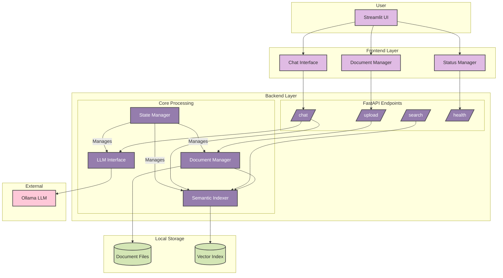

# Reference Chat

Reference Chat is a local document search and chat assistant. It allows you to upload PDF and TXT files (for now, more formats to be explored soon), search and chat with your documents using a local language model, and manage your document collection. All processing is performed locally; no data is sent to external servers.

## Features

- Local-only processing and search
- Upload and manage PDF/TXT documents
- Ask questions and get answers with references to your documents
- Keyword and semantic search
- Download and delete documents
- REST API for programmatic access
- Streamlit-based user interface

## Quick Start

### Prerequisites

- Python 3.8 or newer
- Ollama running locally (https://ollama.ai/)
- Git

git clone https://github.com/esrmnt/local-ref-chat.git

### Installation

Clone the repository and install dependencies:

```bash
git clone https://github.com/esrmnt/local-ref-chat.git
cd local-ref-chat
python -m venv venv
# On Windows:
.\venv\Scripts\activate
# On Linux/Mac:
source venv/bin/activate
pip install -r requirements.txt
```

### Ollama Setup

Install and start Ollama, then pull a model:

```bash
ollama pull llama3
ollama serve
```

### Configuration (Optional)

```bash
cp .env.example .env
# Edit .env as needed
```

### Running the Application

Start the backend:
```bash
python -m uvicorn backend.main:app --reload --host 0.0.0.0 --port 8000
```

Start the frontend (in a new terminal):
```bash
streamlit run frontend/app.py
```

### Access

- Main App: http://localhost:8501
- API Docs: http://localhost:8000/docs
- Health Check: http://localhost:8000/health

## Usage

### Document Management

1. Upload PDF or TXT files using the sidebar.
2. Uploaded files are processed and indexed for search and chat.
3. Browse uploaded documents, view metadata, download, or delete files.

### Chat and Search

1. Ask questions about your documents in the chat interface.
2. Answers are generated using a local language model and reference your documents.
3. Adjust the number of context chunks used for answers in the sidebar.

### Example

**Upload:**  
Choose a PDF/TXT, click Upload.

**Ask a question:**  
```
What are the main points discussed in the 2022 strategy.pdf?
```

**You’ll get (for example):**
```
{
  "answer": "The 2022 strategy.pdf discusses these main points: ...",
  "context": [
    {"filename": "strategy.pdf", "chunk_index": 3, "text_snippet": "...", "citation": "[Source: strategy.pdf, chunk 3]"},
    ...
  ]
}
```

## Architecture

The backend is built with FastAPI and handles document processing, search, and chat endpoints. The frontend is built with Streamlit and provides a web interface for uploading, searching, and chatting with documents. Ollama is used for local language model inference. All document data and processing remain local.

### System Overview



The diagram above shows the high-level architecture of the Reference Chat system. The components are organized into layers:
- **Frontend Layer**: Handles user interaction and document management interface
- **Backend Layer**: Contains the API endpoints and core processing logic
- **Storage Layer**: Manages document files and vector indices
- **External**: Integrates with Ollama for LLM capabilities

### Backend (FastAPI)
```
backend/
├── main.py              # Application setup with lifespan management
├── settings.py          # Environment-based configuration
├── models.py            # Pydantic request/response models
├── logging_config.py    # Structured logging setup
├── config.py            # Backward compatibility layer
├── core/
│   ├── document_manager.py # File handling, validation, text extraction
│   ├── indexer.py          # Semantic indexing and search
│   ├── model.py           # Ollama LLM integration
│   ├── utils.py           # Text processing utilities
│   └── state.py           # Application state management
└── api/
    ├── knowledge.py       # Document upload/management endpoints
    ├── search.py          # Search endpoints (keyword/semantic)
    └── chat.py            # RAG chat endpoints
```

### Frontend (Streamlit)
```
frontend/
├── app.py               # Main Streamlit application
├── components/          # Reusable UI components (future)
└── pages/               # Multi-page app structure (future)
```

## API Endpoints

### Knowledge Management
- `POST /api/v1/upload` - Upload document
- `GET /api/v1/list` - List documents with metadata
- `GET /api/v1/documents/{filename}/info` - Get document information
- `GET /api/v1/documents/{filename}/content` - Get full document content
- `GET /api/v1/documents/{filename}/preview` - Get document preview
- `GET /api/v1/documents/{filename}/chunks` - Get document text chunks
- `GET /api/v1/documents/{filename}/indexed-chunks` - Get indexed chunks with embeddings
- `GET /api/v1/documents/{filename}/download` - Download original document
- `DELETE /api/v1/documents/{filename}` - Delete document
- `POST /api/v1/reindex` - Rebuild search index

### Search
- `GET /api/v1/search` - Keyword search
- `GET /api/v1/semantic_search` - Semantic search
- `GET /api/v1/search/stats` - Search statistics

### Chat
- `GET /api/v1/ask` - Ask a question (RAG)
- `POST /api/v1/ask` - Ask a question (POST method)
- `GET /api/v1/ollama/status` - Check Ollama status

### System
- `GET /health` - Application health check

More information on each endpoint is available in the API documentation at [API Reference](ApiReference.md).

## Troubleshooting

### Common Issues

**Backend won't start:**
- Check Python version (3.8+ required)
- Verify all dependencies installed: `pip install -r requirements.txt`
- Check port 8000 is available

**Ollama not working:**
- Ensure Ollama is installed and running: `ollama serve`
- Check model is available: `ollama list`
- Verify API URL in configuration

**File upload fails:**
- Check file size limits (default 50MB)
- Verify file type is supported (PDF, TXT)
- Check available disk space

**Empty search results:**
- Ensure documents are uploaded and indexed
- Check if questions match document content
- Try different phrasings or keywords

## Next Steps

- Add clean UI for search and chat (currently basic).
- Add support for more file types (DOCX, Markdown).
- Persist the document index/embeddings to disk for faster restarts.
- Enhance chat memory for multi-turn dialog.
- Collect feedback with citations, provide an export or summary feature.

## Credits

- [FastAPI](https://fastapi.tiangolo.com/) for the API.
- [SentenceTransformers](https://www.sbert.net/) for semantic embeddings.
- [Ollama](https://ollama.com/) for local LLM serving.
- [Streamlit](https://streamlit.io/) for the beautiful frontend framework
- NLTK for sentence segmentation.
- PyPDF2 for robust PDF extraction.

## License

MIT License. See [LICENSE](LICENSE) for details.